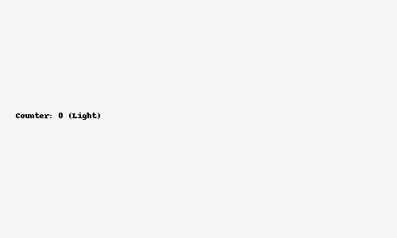
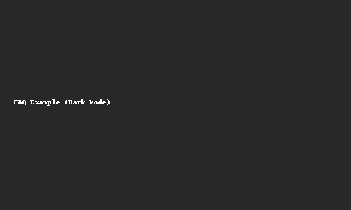

# ⚡ Interactive Web Pages with JavaScript

[](#) 
[](#)
[](#)
[](#)
[](#)

This project demonstrates **JavaScript event handling**, **interactive UI elements**, and **custom form validation** without reloading the page.  
Built with semantic **HTML5**, **CSS3**, and **vanilla JavaScript** — no frameworks.

---

## ✨ Features Overview

| Feature                  | Description |
|---------------------------|-------------|
| 🌗 Theme Toggle           | Switch between light/dark themes, saved in `localStorage`. |
| 🔢 Counter Game           | Increment/decrement/reset via buttons or keyboard (`↑`, `↓`, `R`). |
| ❓ Accessible FAQ          | Expand/collapse questions with smooth animation & ARIA attributes. |
| 📝 Custom Form Validation | Full validation (name, email, password, confirmation, terms) with **inline messages** and accessible feedback. |

---

## 🖼️ Demo & Screenshots

### Theme Toggle


### Counter with Keyboard


### FAQ (Collapsible)


### Sign-up Form Validation


---

## 🚀 Live Preview

👉 **[GitHub Pages Deployment](https://Augusto047.github.io/interactive-web-pages-javascript/)**

---

## 📂 Project Structure

```
.
├── index.html        
├── style.css
├── script.js         
├── assets/           # Images and GIFs
└── README.md
```

---

## 👨‍💻 Author

**Augusto Mate**  
📧 [mate.augusto.mz@gmail.com](mailto:mate.augusto.mz@gmail.com)  

---

> ⚡ *Crafted with attention to UX, accessibility (ARIA, keyboard support), and clean code — perfect for academic and professional showcase.*
